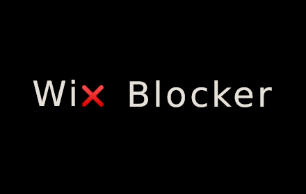

# Wix Blocker

Wix Blocker allows you to filter out websites built on the Wix platform while you browse the web.

## Palestine

This project is a partner with TechForPalestine, an organisation to help the cause of the Palestinian people using technology.

<strong>Learn more about TechForPalestine here:</strong>
 

## Why

Wix is an Israeli website builder & hosting company. It was born out of the Israeli military’s notorious unit 8200, specialising in Cyber terror attacks, intelligence for assassinations, & spying on Palestinians living under occupation. It’s Israel’s most valuable company, worth $19 billion (2021).

While Wix is a publicly listed company, it's headquarters are in Tel Aviv, Israel and the company is fully supportive of the suffereing of the Palestinian people.

An employee of Wix in Dublin, Ireland "was told that she was dismissed with immediate effect over her statements criticising Israel on social media." in October 2024.

The goal of this project is to support the organic BDS campaign against the economy of Israel.

[Learn more here about BDS](https://bdsmovement.net/Act-Now-Against-These-Companies-Profiting-From-Genocide)

## Install

Wix Blocker is extension is published for download.

Install it from the [Chrome Web Store](https://chromewebstore.google.com/detail/bds-wix-blocker/ggpmckplkboocoljlhgeakgndfphbnkm)

<table width="200px">
    <thead>
    <th colspan="2">
    &nbsp;&nbsp;&nbsp;&nbsp;&nbsp;&nbsp;&nbsp;&nbsp;&nbsp;&nbsp;&nbsp;&nbsp;&nbsp;&nbsp;&nbsp;&nbsp;&nbsp;&nbsp;&nbsp; Available for Browsers &nbsp;&nbsp;&nbsp;&nbsp;&nbsp;&nbsp;&nbsp;&nbsp;&nbsp;&nbsp;&nbsp;&nbsp;&nbsp;&nbsp;&nbsp;&nbsp;&nbsp;&nbsp;&nbsp;
    </th>
    </thead>
    <tbody>
        <tr>
            <td>
                Google Chrome
            </td>
            <td align="center">
                
            </td>
        </tr>
        <tr>
            <td>
                Brave Browser
            </td>
            <td align="center">
                
            </td>
        </tr>
        <tr>
            <td>
                Microsoft Edge
            </td>
            <td align="center">
                
            </td>
        </tr>
    </tbody>
</table>

I'm looking into porting the extension to Firefox too 
## Issues

If you have found a bug or you have a feature request or , open an [issue](https://github.com/bdsally/wix-blocker/issues).

## Contributing

See [CONTRIBUTING](CONTRIBUTING.md)

## License
Wix Blocker is [MIT licensed](LICENSE).

